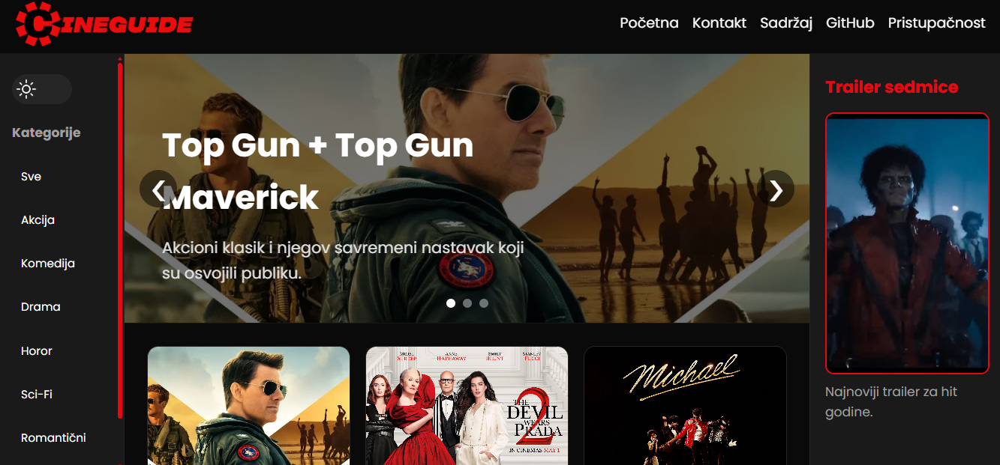

# Grupa14-TPTP-2026

Završni projekat iz predmeta TPTP Fakulteta elektrotehnike u Tuzli.

Naziv projekta: CineGuide

Tema: Platforma za recenzije aktuelnih filmova u lokalnim kinima

Projekat predstavlja modernu web lokaciju za pregled filmskih recenzija, preporuka i multimedijalnog sadržaja. Fokus projekta je na responzivnom dizajnu, interaktivnosti i modernom korisničkom iskustvu koristeći HTML5, CSS3 i JavaScript bez frameworka.

# Članovi grupe:

| Član | Index | GitHub | Zadatak |
|---|---|---|---|
| Bulić Zara | 25134 | zarabulic | HTML |
| Kavazović Amir | 25058 | amirkavazovic12 | CSS |
| Kešetović Amir | 25006 | amirkesetovic | JavaScript |

# Kratak opis projekta:
Tema projekta je web platforma za:
- pregled filmskih recenzija
- preporuke filmova
- galerije filmskih postera
- prikaz trailera
- interaktivno filtriranje sadržaja

Korisnici mogu pregledati recenzije različitih filmova, koristiti dark/light mode, filtrirati sadržaj po kategorijama i pristupiti detaljnim informacijama o filmovima.

#  Korištene tehnologije
- HTML5
- CSS3
- JavaScript (Vanilla JS)
- Flexbox
- CSS Grid
- Media Queries
- LocalStorage
- Google Fonts

  #  Implementirane funkcionalnosti

## HTML5
- Semantička struktura (`header`, `nav`, `main`, `aside`, `footer`)
- Više HTML stranica
- Tabela sadržaja
- Galerija slika
- Image map
- Bookmark navigacija
- Forme sa labelama
- Alt tekst za slike

  ## CSS3
- Jedna centralna CSS datoteka
- CSS varijable
- Flexbox i Grid layout
- Responzivni dizajn
- Hover efekti i tranzicije
- Dark/Light mode stilovi
- Media queries za mobilne uređaje, tablete i desktop

## JavaScript
- Dinamičko filtriranje filmova
- Dark/Light mode toggle
- LocalStorage pamćenje teme
- Validacija kontakt forme
- Interaktivni slider
- Smooth scroll navigacija

  ---

# Responzivnost

Web aplikacija je optimizovana za:
- desktop uređaje
- tablete
- mobilne telefone

Korišteni su media query breakpointi:
- mobile (<600px)
- tablet (600px–900px)
- desktop (>900px)

---

#  Dark / Light mode

Aplikacija podržava:
- tamni mod
- svijetli mod
- pamćenje korisničkog izbora preko `localStorage`

---

# Struktura projekta

```bash
Grupa14-TPTP-2026/
│
├── index.html
├── sadrzaj.html
├── kontakt.html
│
├── css/
│   └── tptpstil.css
│
├── js/
│   └── tptpskripte.js
│
├── images/
│
└── README.md
```

---

# Korištenje AI alata
Tokom razvoja projekta korišteni su AI alati kao pomoć pri:
- objašnjavanju CSS i JavaScript koncepata
- optimizaciji layouta
- debagovanju koda
- prijedlozima za responzivni dizajn
- validaciji regex izraza
  Sav kod korišten u projektu je analiziran, prilagođen i implementiran od strane članova tima.

---

# Pokretanje projekta
1. Klonirati repozitorij:
```bash
git clone https://github.com/amirkesetovic/Grupa14-TPTP-2026.git
```
2. Otvoriti projekat u VS Code-u

3. Pokrenuti `index.html` pomoću:
- Live Server ekstenzije
ili
- direktno u browseru

---

# GitHub repozitorij
https://github.com/amirkesetovic/Grupa14-TPTP-2026

---

#  Screenshot projekta



---

# Predmet

Tehnologije za podršku tehničkom pisanju (TPTP)  
Akademska godina: 2025/2026
